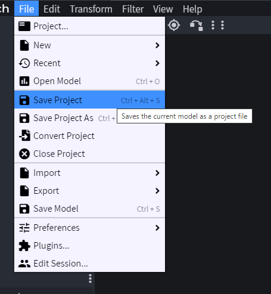

# ModelEngine-Model-Tutorial_ZH_CN

### Creating a Model 创建模型

Model Engine 需要模型文件来在游戏中显示模型。它专为与 BlockBench 无缝配合而设计。BlockBench 是一款免费的建模软件，可用于建模、贴图和动画制作。

> 注意：本页面不会详细介绍如何使用 BlockBench 或进行贴图。建议你在网上查找相关教程视频或文章。

要开始建模，请在启动页面中创建一个新的 通用模型（Generic Model）项目，并填写文件名（File Name）。
该文件名将作为模型在 Model Engine 中的 ID，请谨慎命名。
> 
> 

在继续之前，你必须学习一些非常重要的概念。

### Bones and Cubes 骨头和立方体
_________________

在建模时，了解 `Bones` 和 `Cubes` 之间的区别非常重要。

Cubes 是模型中的每一个独立立方体。Bones 是立方体的文件夹，用于将它们进行分组。
Model Engine 通过将一个通用（Generic）或基岩版（Bedrock）模型按照骨骼进行拆分，转化为多个资源包兼容的模型，从而实现流畅的动画效果。
在游戏中，每一个骨骼（Bone）由一个盔甲架（armor stand）表示，并将新模型佩戴在其头部。

由于新模型被放入了资源包中，Cubes 必须遵守 Minecraft 物品建模的规则和限制：

* 旋转角度只能是 0、22.5、-22.5、45 和 -45，像 90 和 67.5 这样的旋转是不被支持的。

* 只能对一个轴进行旋转。

然而，Bone 的限制更少：

* 可以无限制地进行旋转。

你可以仅使用 Bones 来构建整个模型，但由于每一个带模型的骨骼都会占用一个实体，因此在 `Bone` 和 `Cube` 之间保持平衡是比较明智的。
不包含任何模型的骨骼被称为 `Virtual Bones`（虚拟骨骼），它们不会生成盔甲架。

在 Blockbench 中，你可以通过在大纲视图（Outliner）中添加一个 `folder` / `group` 来创建一个 `Bone`，然后就可以开始向这个骨骼中添加 `cubes` 了。

> 

让我们做一个简单的动物模型。认识一下 `Mr.Capybara` ！

>  

当你进行建模时，请确保在 Blockbench 中查看网格，并确认你的模型面朝 北方。
Model Engine 默认使用 北方 作为“前方”方向。
这个网格的大小是 16×16 像素，或者说相当于游戏中的 1 个方块大小，如果你需要一个比例参考的话。

> 注意：方便的是，这个网格正好对应于 Minecraft 的地面高度。如果你希望模型是站立状态，请确保模型的“脚”贴在这个网格上！

### Parenting 父子结构
_________________

不，这与教育孩子无关。
父子关系是指将一根骨骼放入另一根骨骼内。外侧骨骼是父骨骼，内侧骨骼是子骨骼。子骨骼。这很有用，因为子骨骼将跟随父骨骼同时为模型[制作动画](https://git.lumine.io/mythiccraft/model-engine-4/-/wikis/Animating-a-Model)。
创建父子骨骼层次结构是一种很好的做法，这样在制作动画时，骨骼就会保持在正确的位置。

通常，骨骼会根据其连接方式配对。例如，将 `Arm`（子骨骼）连接到 `Body`（父骨骼），这样无论 `Body` 如何移动或旋转，`Arm` 都会紧贴在 `Body` 上。

我们也对 `Mr.Capybara` 做同样的事吧。
> 

### Pivot Point  枢轴点
_________________

每块骨骼都有一个枢轴点。它决定了骨骼的旋转方式。例如，`Arm` 骨骼应该在 `Body` 骨骼的侧面附近旋转，因此你需要将枢轴点放置在身体骨骼旁边。所有骨骼都应该有一个合适的枢轴点，否则在设置动画时，它们会旋转得很奇怪。

您可以在 BlockBench 中通过选择枢轴工具，然后选择骨骼文件夹（不是立方体）并拖动枢轴点来设置骨骼的枢轴点。
> 

### Hitbox and Eye Height  命中框和眼高
_________________
创建模型后，剩下的就是为模型分配一个命中框和眼睛高度。

`Hitbox` 工作原理与原版 `Hitbox` 完全相同。你可以击打它，也可以向它射箭，但如果模型试图穿过太小的缝隙，它就会被卡住。

另一方面，`Eye Height` 告诉模型引擎模型的高度。当生物体较矮时，它倾向于仰视你。当生物体较高时，它则俯视你。 `Eye Height` 允许你设置模型的精确高度，以便模型能够正确地注视你。它也是“呼吸”位置，如果生物体处于固体方块中，它就会窒息。

通过添加一个名为 `hitbox` 的骨骼来创建这两个视图，骨骼内部有一个立方体。立方体的大小就是 `hitbox` 的大小，眼睛的高度就是 `hitbox` 骨骼枢轴点的 `Y` 值。

由于 Minecraft 的限制，碰撞箱的 `X` 和 `Z` 值必须相同。因此，模型引擎仅读取
立方体的最大宽度，忽略 `Z` 轴尺寸。碰撞箱也必须遵守 Minecraft 的碰撞箱限制，即方块尺寸为 `64x64x64`（像素尺寸为 `1024x1024x1024`） 。

> 

### Shadow  阴影
_________________

为了最终完成模型，您可以选择为模型创建阴影，使其在游戏中更加贴近地面。阴影大小任意，始终以模型为中心，并位于地面高度。如果模型没有阴影，游戏中也不会有阴影。

要创建阴影，请添加一个名为 `shadow` 的骨骼，骨骼内部包含一个立方体。立方体的最大宽度将作为阴影的直径，而立方体的高度将被忽略。

> 

### Special Bone Behaviors  特殊骨骼行为
_________________

模型引擎默认添加了许多自定义骨骼行为。这些骨骼行为可以改变骨骼的功能，例如启用头部旋转、将骨骼转换为座位，甚至添加子碰撞箱。更多信息，请参阅[骨骼行为](https://git.lumine.io/mythiccraft/model-engine-4/-/wikis/Modeling/Bone-Behaviors) 。

### Saving Generic Project  保存通用项目
_________________

创建模型后，当然要保存它！确保使用正确的格式。点击 `Files/Save Project` 保存模型、纹理和动画。它应该保存在 `.bbmodel` 下。
格式。

> 